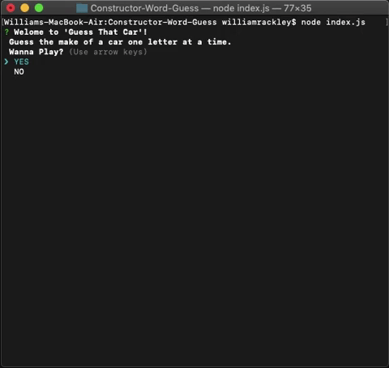
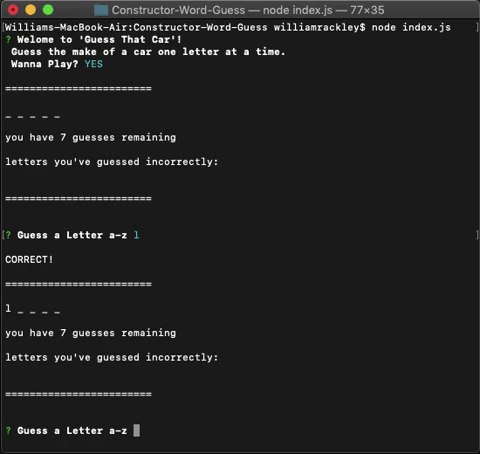

# Constructor-Word-Guess
This is a Node Word Guess command-line game that use constructor functions that are required from different files. The user is presented with an array of words, one word at a time, where the letters are hidden. In this game all of the words are car makes (ex. Lexus, Toyota, Acura). The user is allowed to guess one letter at a time. They are only allowed 7 incorrect guesses per word. Once they run out of guesses then the game is over. The user wins the game once they have successfully guessed all the words.

## Game Play
* At the beginning of the game the user is presented with a prompt explaining the game, and if they would like to play. If they decide to play, they are presented with the first word to guess.

* Once the user starts guessing, if they guess correctly then the letter is displayed. If the user guesses in correctly then that letter is displayed in the area that says "letters you've guessed incorrectly: " and you lose a remaining guess. If the user types anything other than a letter than they are prompted to choose a letter A-Z. They are not penalized a remaining guess.

